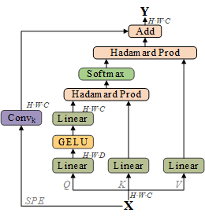

# <div align=center> Multi-stage Feature-aware Transformer Network for Facial Expression Recognition </div>

<div align=center>


Fig. 1 Architecture of Multi-stage Feature-aware Transformer Network for Facial Expression Recognition
</div>


<div align=center>



Fig. 2 Architecture of Adaptive Context Attention mechanism
</div>


## 1、Preparation
- Download pre-trained model weight of `MSCeleb`(coming soon...).
- Download [RAF-DB](http://www.whdeng.cn/raf/model1.html) dataset and extract the `raf-basic` dir to `./data`.
- Download [AffectNet](http://mohammadmahoor.com/affectnet/) dadtaset and extract the `AffectNet` dir to `./data`.
- Download [ExpW](http://mmlab.ie.cuhk.edu.hk/projects/socialrelation/index.html) dadtaset and extract the `ExpW` dir to `./data`.
- Then `preprocess` the datasets as follow:
## 2、Data preparation:
- We use the face alignment codes in [face.evl](https://github.com/ZhaoJ9014/face.evoLVe/#Face-Alignment) to align face images first.
- the `aligned` face struct as follow:
```
  - data/raf-db/
		 train/
		     train_00001_aligned.jpg	# aligned by MTCNN
		     train_00002_aligned.jpg	# aligned by MTCNN
		     ...
		 valid/
		     test_0001_aligned.jpg	# aligned by MTCNN
		     test_0002_aligned.jpg	# aligned by MTCNN
		     ...
 ```


## 3、Weight

The main code and checkpoints of MFTN-FER for FER will come soon!


## 4、Training

```
CUDA_VISIBLE_DEVICES=0 python main.py --help
```

## 5、Results
Pre-trained models can be downloaded for evaluation as following:

|     dataset 	| accuracy 	| checkpoint  |
|:-----------:	|:--------:	|:----:	      |
|    `RAF-DB`   | `92.20`    	|`Coming soon`|
| `AffectNet-8` | `63.48`    	|`Coming soon`|
| `AffectNet-7` | `66.57`       |`Coming soon`|
|    `ExpW`   	| `74.29`    	|`Coming soon`|


## 6、Confusion Matrices for MFTN-FER
<div align=center>
Confusion Matrices for MFTN-FER on RAF-DB, AffectNet-7, AffectNet-8 and ExpW
</div>
<div align=center>


Fig. 3(a) RAF-DB 	\;	(b) ExpW 	\;	(c) AffectNet-7 	\;	(d) AffectNet-8
</div>


<div align=center>
Confusion Matrices for Baseline on RAF-DB, AffectNet-7, AffectNet-8 and ExpW
</div>
<div align=center>


Fig. 4(a) RAF-DB 	\;	(b) ExpW 	\;	(c) AffectNet-7 	\;	(d) AffectNet-8
</div>


## 8、Grad_CAM of different expressions on some examples face from AffectNet dataset
<div align=center>
Grad-CAM for MFER on RAF-DB dataset
</div>
<div align=center>


Fig. 5 Grad-CAM
</div>


## Acknowledgement
Thanks for the code of the following:\
[ConvNext](https://github.com/facebookresearch/ConvNeXt.)


[WZMIAOMIAO](https://github.com/WZMIAOMIAO/deep-learning-for-image-processing)


[POSTER_V2](https://github.com/Talented-Q/POSTER_V2)
